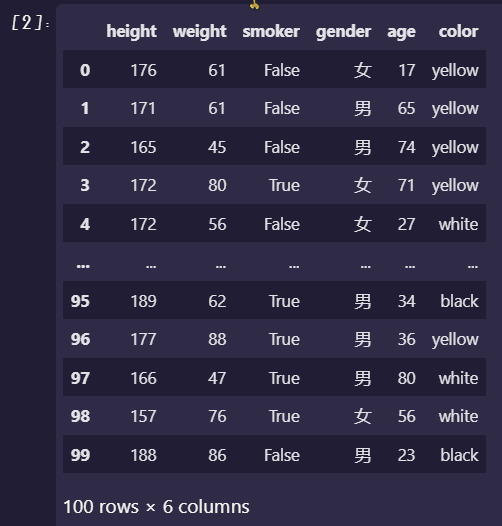
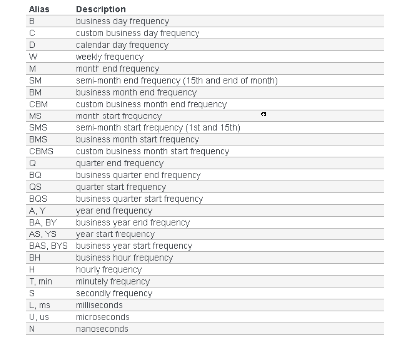

# Pandas补充

## 三个高级接口

Series提供了三个属性接口：cat，dt，str，分别对应分类，日期，字符串数据

### dt接口

数据类型为datetime

|                             函数                             |         调用方式          |                             说明                             |
| :----------------------------------------------------------: | :-----------------------: | :----------------------------------------------------------: |
|                           dt.date                            |    df[‘time’].dt.date     |                  返回其日期部分, object类型                  |
|                        dt.normalize()                        | df[‘time’].dt.normalize() |                 返回其日期部分,datetime类型                  |
| dt.year,dt.month,dt.day,dt.hour,dt.minute,dt.second,dt.week,dt.weekofyear |    df[‘time’].dt.year     | 返回日期中的部分数据,dt.week和dt.weekofyear都是返回一年中第几周 |
|           dt.weekday,dt.dayofweek,dt.weekday_name            |                           |              返回一天是周几,name那个返回英文名               |
|                         dt.dayofyear                         |                           |                       返回一年的第几天                       |
|                          dt.quarter                          |                           |                        返回第几个季度                        |
|       dt.is_month(year,quarter)_start, dt.is_month_end       |                           |                  判断这一天是不是月底和月初                  |
|                       dt.is_leap_year                        |                           |                        判断是不是闰年                        |
|                        dt.month_name                         |                           |                         返回英文名称                         |


### str接口

数据类型为object

[这里提供了Series.str的方法:Pandas之Series.str列内置的方法详解 - 知乎 (zhihu.com)](https://zhuanlan.zhihu.com/p/30894133)


#### cat接口

数据类型为category

|           函数           |              调用方式              |     说明     |
| :----------------------: | :--------------------------------: | :----------: |
|         category         |            cat.category            |   查看类别   |
|    rename_categories     | cat.rename_categories(list(‘cba’)) |  类别重命名  |
|      add_categories      |   cat.add_categories(list(‘de’))   |   添加类别   |
|    remove_categories     |                                    |   删除类别   |
| remove_unused_categories |                                    | 删除无用类别 |


## 数据处理三板斧——————map、apply、applymap

在数据处理中，我们不免会对一个DataFrame产生逐行，逐列，逐元素的操作需求。对这些操作，我们可以使用map、apply、applymap高性能的解决。

```python
# 随机生成6行一百列的数据
boolean=[True,False]
gender=["男","女"]
color=["white","black","yellow"]
data=pd.DataFrame({
    "height":np.random.randint(150,190,100),
    "weight":np.random.randint(40,90,100),
    "smoker":[boolean[x] for x in np.random.randint(0,2,100)],
    "gender":[gender[x] for x in np.random.randint(0,2,100)],
    "age":np.random.randint(15,90,100),
    "color":[color[x] for x in np.random.randint(0,len(color),100) ]
}
)
```

结果如下：



### 对于Series而言

#### map

思考一个问题，现在要求，你将gender列的男变成1， 女变成0，该怎么办？如果用for也太慢了！！！

```python
data['gender'] = data['gender'].map({'男':1, '女':0})  # 这一条代码就可以了, 是不是非常快!!!

#当然map支持函数方法,可以自定义
def gender_map(x):
	gender = 1 if x == '男' else 0
	return gender
	
data['gender'] = data['gender'].map(gender_map)  # 这里map改为apply也可以实现

"""
原理是因为,map方法是把对应的数据逐个当成参数传入到字典或函数中,然后得到映射的值。
"""
```


#### apply

apply方法的作用原理和map方法类似；

区别是

1. apply可以传入多个参数，而map只能接受一个参数。（map能实现的，apply都可以实现）
2. apply不能通过传入字典实现，而map可以

假设在数据统计的过程中，年龄age列有较大误差，需要对其进行调整（加上或减去一个值），由于这个加上或减去的值未知，故在定义函数时，需要加多一个参数bias，此时用map方法是操作不了的（传入map的函数只能接收一个参数），apply方法则可以解决这个问题。

```python
def apply_age(x,bias):
    return x+bias
​
#以元组的方式传入额外的参数
data["age"] = data["age"].apply(apply_age,args=(-3,))
```


### 对于DataFrame而言

没有map方法，但多了一个applymap方法。

对于apply方法，多了一个axis操作,以及从DataFrame中提取Series的操作


## pivot和pivot_tabel

#### pivot

pivot：通过指定的索引和列对数据进行重塑，无法聚合。

说白了，就是将规范数据表，转化成混合数据表

DataFrame.pivot(index, columns, value)

直接根据index,columns,value进行整合


#### pivot_table

pivot_table：通过指定的索引和列对数据进行重塑，可以聚合

方法与pivot一样


## Sample方法

```
DataFrame.sample(n=None, frac=None, replace=False, weights=None, random_state=None, axis=None)
"""
n表示随机抽取几个
frac表示抽取比例 如0.9(pandas采取五舍六入的方法)
replace就是表示放不放回
weight就是增大你输入的这一行或者一列被抽中的概率
axis就是按行还是按列
"""
```


## 分箱操作

#### pd.cut

```python
pd.cut(x, bins, right=True, label=None, rebins=False, precision=3, include_lowest=False, duplicates='raise')
"""
x: 一维数组
bins: 整数,标量序号,或者间隔索引,分组的依据
	如果填入整数,则是将x中的数值做成n等分(每一组最大值与最小值差约相等)
	如果传入标量序列,则序列中的值为分档标准
right:表示是否包含右边
labels:表示分组后的标签
retbins:是否显示分箱的分界值
precision:存储和显示分箱标签的精度
include_lowers:表示区间的左边是开还是闭,默认不包含左边
"""
```

#### pd.qcut

这个是根据分位数进行划分

```python
pd.qcut(x, q, labels=None, retbins=False, precision=3, duplicates='raise')
"""
x: 一维数组
q:表示分位数的整数或数组
	10表示10分位数, 4表示4分位数
	[0, 0.25, 0.5, 0.75, 1]表示四分位数
其余与cut一致
"""
```


## Stack与Unstack

stack为堆叠，作用是将列旋转到行

unstack即为stack的反操作，即将行旋转到列


## 重新采样时间序列频率

resample函数是对时间序列数据进行重采样的函数。

### 下采样并执行聚合

下采样是将时间序列数据集采样到一个更大的时间框架上，比如，从原先的几分钟，变换几小时。可以让结果行数减少。

```
df.resample('2H').sum()
"""
若你有两个数据,
2017-01-02 09:02:03, 5
2017-01-02 09:14:13, 7
则变为
2017-01-02 08:00:00, 15
2017-01-02 10:00:00, 0
"""
```


