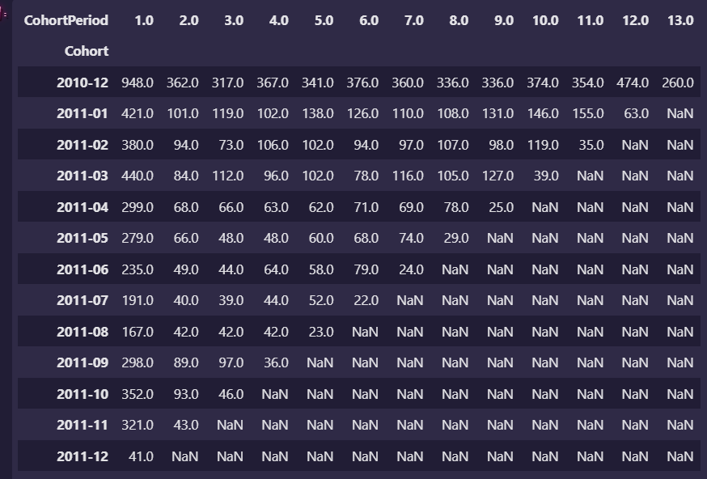

# 第十一章 群组分析

在移动互联的初期，如何让用后发现你的应用并下载它是各方竞争的焦点。当蓝海变成红海后，真正的成功就不是让别人下载你的应用，产品若没有很好地留存，花费大量时间和资源来挖掘新客户，终将“世事转头空”。对于产品运营人，需要考虑的问题已经变成：

+ 如何提高用户留存率
+ 如何找到用户流失的原因？
+ 如何挽回将要流失或以及流失的用户？
+ 用户群体有什么特征？
+ 重点需要关注的用户群是那些？

然而，所有的这些问题都可以用群组分析（Cohort Analysis）来完成。


### 群组分析概述

#### 从AARRR到RARRA的转变

AARRR模型就是考虑五个问题:

1. 用户获取(Acquisition)
2. 用户激活(Activation)
3. 用户留存(Retention)
4. 用户推荐(Referral)
5. 收入(Revenue)

RARRA模型就是更换了顺序,认为留住老用户比寻找新用户更重要


#### 什么是群组分析

群组分析(Chhort Analysis)就是群组分析，即将用户分成不同的群组进行分析。群组分析的实现非常简单，就是首先做好观察用户的分组。分组先分维度，再分粒度。所谓维度，如果按用户的新增日期分组，时间就是维度；如果按新增用户的渠道来分组，渠道就是维度。而粒度是指在该维度如何划分，如时间维度是按照月还是天划分；新增渠道是按新增的来源网站还是来源的具体网址划分，这些都是粒度差异。以下群组就可能是实际数据分析中会遇到的群组。

+ 过去30天试用产品的用户；
+ 5月的付费用户；
+ 通过社交媒体获得的客户；
+ 把商品加入购物车却没有完成付款的用户。

我们可以根据分析需要划分出无数个用户群，之后就可以计算分组留存率，通过对比的差异值逐级锁定，寻找原因。


### 群组分析实战

仍使用英国电商的销售数据

#### 定义群组以及周期

```python
import numpy as np
import pandas as pd
import matplotlib.pyplot as plt
import matplotlib as mpl
import seaborn as sns
import warnings

%matplotlib inline
warnings.filterwarnings('ignore')
sns.set_style('whitegrid')
color = sns.color_palette()
plt.rcParams['font.sans-serif'] = 'SimHei'
plt.rcParams['axes.unicode_minus'] = False


file = r'../data/OnlineRetail.csv'
online = pd.read_csv(file, encoding='Unicode_escape', parse_dates=['InvoiceDate'])
online.head()

online.info()
```

这里可以看到有部分数据是缺失的，不过这里先不进行处理。群组分析的第一步是思考分析的目标是什么，如果想了解不同时期用户的留存率有无变化，购买了有无变化，那么可以以InvoiceDate作为分组依据。因此，时间就是前面提到的维度。游戏、应用推广有的会以天、轴为粒度来观察用户的激活、在线、购买趋势，而对当前问题以月为粒度就可以了。

虽然InvoiceDate列提供了日期信息，但是它不是以月来度量。因此，第一步是对数据进行重构，转换成月来区分，之后需要将客户（由CustomerID唯一提供）按其首次购买月来分组。

```python
# 将每个数据改为其年其月第一日

def get_month(x):
    return datetime.datetime(x.year, x.month, 1)

online['InvoiceMonth'] = online['InvoiceDate'].map(get_month)
```

有了用户购买月信息之后,我们就可以对所有的订单先按照客户，再按照购买月进行分组。然而，群组分析想要的是按照用户首次购买约进行分组，此时就可以使用pandas中的groupby方法提供的transform功能实现这个方法.

```python
# 获得每个用户第一个购买产品的信息
grouping = online.groupby('CustomerID')['InvoiceMonth']
online['CohortMonth'] = grouping.transform('min')
online.tail()
# CohortMonth这一列信息记录的是，该用户第一次购买产品的月份数据
```

CohortMonth就是群组分析分析需要的群组信息，而分析目标是了解不同群组随着时间流失有何变化。因此，还缺少一个时间周期信息，即对应群组在1个月后的购买情况如何，2个月后的购买情况如何，等等。该信息可以通过整合InvoiceDate和CohortMonth来获得。

```python
# 具体操作获取第一个购买的时间，在获取现在购买物品的时间，两者作差。

# Step1： 获取时间
def get_date_int(df, columns):
    year = df[columns].dt.year
    month = df[columns].dt.month
    return year, month


cohort_year, cohort_month = get_date_int(online, 'CohortMonth')
invoice_year, invoice_month = get_date_int(online, 'InvoiceDate')

# Step2：获取差值，并赋给CohortPeriod列
year_diff = invoice_year - cohort_year
month_diff = invoice_month - cohort_month
online['CohortPeriod'] = year_diff * 12 + month_diff + 1  # +1是1为初始值
```


#### 群组分析具体过程

现在，CohortMonth列提供了群组的维度，CohorPeriod列提供了群组的粒度，接下来就是要统计用户活跃情况了。

在开始之前，为了后面可视化的美观，需要对CohortMonth进行美化，由于datetime必须传入day的信息，而我们事实上不需要day的信息，因此利用字符串的功能进行截断。

```python
online['Cohort'] = online['CohortMonth'].astype(str)
online['Cohort'] = online['Cohort'].map(lambda x: x[:-3])
```

活跃用户数的统计，可以通过每个群组中不同的CustomerID获得。

```python
# 根据群组进行统计
cohort_data = online.groupby(by=['Cohort', 'CohortPeriod'])['CustomerID'].nunique()
cohort_data = cohort_data.reset_index()  # groupby格式变回来
```

至此，我们就完成了所有的数据准备工作，Cohort列提供了群组，CohortPeriod提供了时间周期，CustomerID列提供了活跃用户数。

接下来，我们唯一需要做的就是将数据按照时间周期进行展示，即按照不同的Cohort来观察不同的CohorPeriod、CustomerID中的变化。

```python
cohort_counts = cohort_data.pivot_table(index='Cohort', columns='CohortPeriod', values='CustomerID')
cohort_counts
```



从这个结果可以看出，一开始，用户有948个活跃用户，但是第二个周期就只有362个活跃用户了，之后没什么变化，再第十二个周期之后数量出现了增长，然后13个周期又突然下降。

可以看出，群组分析很好地展示了这一趋势变化，数据分析人员很自然地就会思考开始的用户下降的原因，之后的用户增长是促销还是别的原因导致。

计算留存率

```python
cohort_sizes = cohort_counts.iloc[:, 0]
retention = cohort_counts.divide(cohort_sizes, axis=0)  # 也就是整个表 除以第一列
retention
```

将留存率进行可视化

```python
retention = retention.round(3)*100
retention.iloc[[0, 1, 2], :].T.plot(figsize=(10, 8), fontsize=15)
plt.title('群组分析')
plt.xticks(np.arange(1, 12))
plt.xlim(1, 12)
plt.ylabel('留存率')
plt.xlabel('周期')
```

还可以画热力图

```python
plt.figure(figsize=(10, 8))
plt.title('留存率')
sns.heatmap(data=retention, annot=True, vmin=0, vmax=50, cmap='BuGn')  # annot就是在网格上增加数字 ,v就是颜色最深是多少,最浅是多少
```


还可以对购买量进行分析

```python
grouping = online.groupby(['Cohort', 'CohortPeriod'])
cohort_data = grouping['Quantity'].sum()
cohort_data = cohort_data.reset_index()
cohort_data

agveage_quantity = cohort_data.pivot_table(index='Cohort', columns='CohortPeriod', values='Quantity')
agveage_quantity
```

