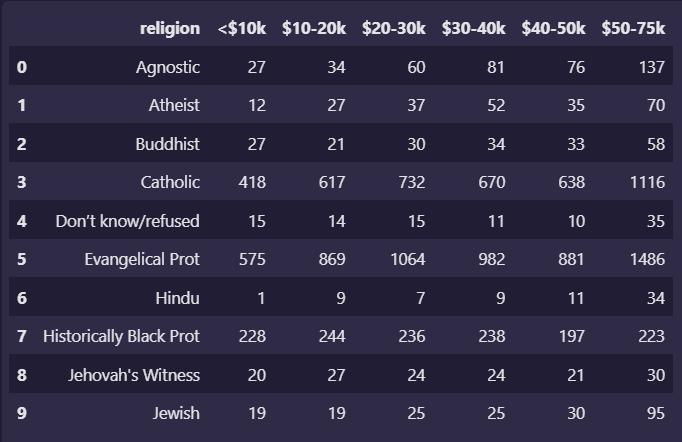
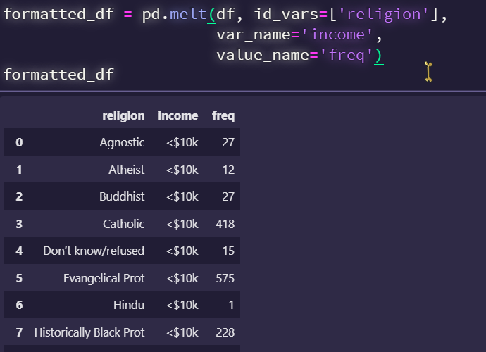
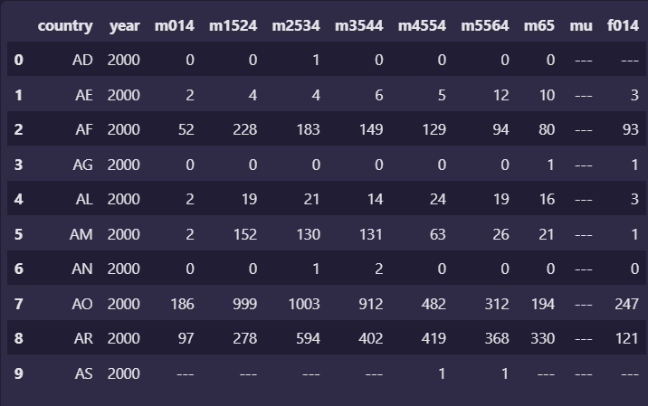
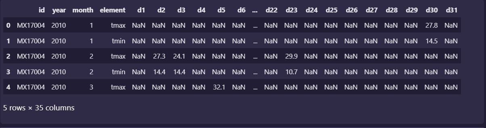
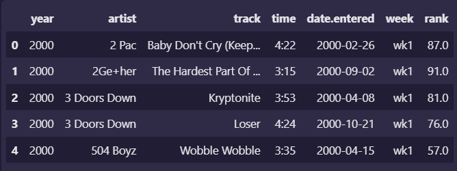

# 第六章 数据整理

统计证明：数据科学家80%的时间都用于数据清洗和准备的过程。

数据清洗的第一步目标总结为“完全合一”。

+ 完整性：单挑数据是否存在空值，统计的字段是否完善。
+ 全面性：观察某一列的全部数值，可以看到该列的平均值、最大值、最小值。我们可以通过常识判断该列是否有问题。
+ 合法性：数据的类型、内容、大小的合法性，如销售额为负，年龄超过200等。
+ 唯一性：数据是否存在重复记录，因为数据通常来自不同渠道的汇总，重复的情况是常见的。行数据与列数据都需要是唯一的，例如人不能重复记录多次，相同数据不能多列重复。


本章重点讨论数据清洗的第二步：数据整理（Tidy Data）

### 数据整理

#### 数据的语义

现实中大多数统计数据集都是矩阵的表格，由行和列构成。各列几乎总带有标签，而个行有时也带有标签。

| 观察对象\治疗方案 | 治疗方案a | 治疗方案b |
| :---------------: | :-------: | :-------: |
|    John Smith     |    --     |     2     |
|     Jane Doe      |    16     |    11     |
|   Mary Johnson    |     3     |    11     |

上述表格是一种数据展现方式。

| 治疗方案\观察对象 | John Smith | Jane Doe | Mary Johnson |
| :---------------: | :--------: | :------: | :----------: |
|     治疗方案a     |     --     |    16    |      3       |
|     治疗方案b     |     2      |    11    |      11      |

同样可以由上述表格展现。


数据相同，但是展现的布局不同。显然，除了数据的外观，需要一种统一方式来描述表格所展示数值的语义或含义。因此，需要对数据进行下列定义。

+ 一个数据集是一个组“值”的集合，通常不是数字（定量的）就是字符串（定性的）。
+ 每个“值”属于一个变量和一个观察对象。
+ 一个变量包含测量各个观察对象同一内在属性的所有值（如高度、温度、时长）。
+ 一个观察对象包含测量该对象各不同属性的所有值（如一个人、某一天或一场比赛）。


因此，可得到一个整齐数据表

|   观察对象   | 治疗方案 | 结果 |
| :----------: | :------: | :--: |
|  John Smith  |    a     |  --  |
|   Jane Doe   |    a     |  16  |
| Mary Johnson |    a     |  3   |
|  John Smith  |    b     |  2   |
|   Jane Doe   |    b     |  11  |
| Mary Johnson |    b     |  11  |


#### 整齐的数据

整齐的数据是指数据含义和其结构的标准化匹配方式。一个数据集是混乱还是整齐，取决于行、列、表格与观察对象、变量和类型如何匹配。在整齐的数据中：

+ 每个变量组成一列；
+ 每个观察对象的所有属性组成一行；
+ 每个观察单元的类型组成一个表格。


整齐的数据能让分析师或计算机更容易地提取所需变量，因为它提供了一个构成数据集的标准方式。不幸的是，真实的数据集将会而且经常会以各种可能的方式违反整齐数据的三个原则。

典型的混乱数据通常会具有以下5个常见的问题。

+ 列标题是值，而非变量名。
+ 多个变量存储在一列中。
+ 变量既在列中存储，又在行中存储。
+ 多个观察单元存储在同一个表中。
+ 一个观察单元存储在多个表中。


### 数据整理实战

针对上述出现的5个常见混乱数据的问题，提出解决方案。


#### 列标题是值，而非变量名

第一种常见的混乱数据集是为了展示而设计的表格数据，变量既构成列，又构成行，列标题是值，而非变量名。



这个数据表将”<\$10k“  ”\$10-20k”这些收入变量作为了列名,而表中的数值应该是对应另一变量——人数。因此，该数据集本来有三个变量：宗教、收入和人数。为了对其进行整理，需要把它融合或堆叠。

所谓融合是指将已经是变量的各列的列表(简称id_var）进行参数化,其他的列转变为两个变量:一个被称作列(var_name)的新变量，它包含重复的列标题；另一个被称作值（value_name）的新变量，它包含从之前分离的列中提供联系的数据值。

这里则是用row变量作为id_vars，即宗教为id，将原来的列名转变为columns的值，列中的值转换成另一个columns的值


```python
# 采用pd.melt()方法进行融合

"""
pd.melt(frame, id_vars=None, value_vars=None, var_name=None, value_name='value', col_level=None)
参数解释:
frame: 要处理的DataFrame
id_vars: 表示不需要被转变的列名
value_vars: 需要转化的列名,若剩下的都需要,则不需要写
var_name和value_name则是自定义列名
col_level: 若是多重索引,则需要使用这个
"""

formatted_df = pd.melt(df, id_vars=['religion'], var_name='income', value_name='freq')
```



```python
# 也可以使用堆叠的方式(Stack) 
"""
DataFrame.stack()  其效果将其列名变更为二级索引
"""

formatted_df = df.set_index('religion')  # 给df设置一级索引为信仰
formatted_df = formatted_df.stack()  # 将列名中的收入变为二级索引
formatted_df.index = formatted_df.index.rename('income', level=1)  # 将二级索引名替换为"income"
formatted_df = formatted_df.reset_index()  # 将索引重新设置回去,即可完成融合操作.

```


**:red_circle:实战练习**

采用一个75周的各取排行榜数据集billboard.csv

```python
导入相关库
import pandas as pd
import numpy as np

# 读取数据集
file = r'../data/billboard.csv'
df = pd.read_csv(file)
print(df.head())

# 建立数据融合
id_vars = ['year', 'artist', 'track', 'time', 'date.entered']
var_name = 'week'
value_name = 'rank'
df = pd.melt(df, id_vars=id_vars, var_name=var_name, value_name=value_name)
print(df.head())

# 上述工作已经完成了列标题是指而非变量名的问题处理,但是从数据分析角度来看,数据整理的工作还未完成
# week对应的变量值应该是数值型数据,而非字符串,因此要转换为数值

df['week'] = df['week'].str.extract('(\d+)', expand=False).astype(int)
# str.extract('正则表达式') expand为False,表示返回不为列表返回
```


#### 多个变量存储在一列中



m014表示男性,(0~14)

转为规范表的数目应该为$10\times 9=90$

```python
# 代码如下
import numpy as np
import pandas as pd

file = r'../data/tb.csv'
df = pd.read_csv(file)

id_vars = ['country', 'year']
tmp_df = pd.melt(df, id_vars=id_vars, value_name='case', var_name='sex_and_age')

new_tmp_df = tmp_df['sex_and_age'].str.extract('(\D)(\d+)(\d{2})', expand=False)

new_tmp_df.columns = ['sex', 'age_lower', 'age_upper']

df = pd.concat([tmp_df, new_tmp_df], axis=1)

df['age'] = df['age_lower']+'-'+df['age_upper']

df.drop(['sex_and_age', 'age_lower', 'age_upper'], axis=1, inplace=True)

df.sort_values(ascending=True, by=['country', 'year', 'sex', 'age', 'case'])
```


#### 变量既在列中存储，又在行中存储

当变量既在列中存储，又在行中存储时，就会出现最复杂形式的混乱数据。




该代码存在问题，由于转日期的时候，2月有31天，提示报错，未解决。


**:red_circle:pivot_table**

**数据透视表**是一种可以对数据动态排布且分类汇总的表格格式。在pandas中它被称作pivot_table。

pivot_table的好处

+ 灵活性高，可以随意定制你的分析计算要求
+ 脉络清晰易于理解数据
+ 操作性强，报表神器


如何使用？

```python
"""
pivot_table(data, values=None, index=None, columns=None, aggfunc='mean', fill_value=None, margins=False, dropna=True, margins_name='ALL')
重要的有四个为:index, values, columns, aggfunc
index就是层次字段, 要通过透视表获取什么信息就按照相应的顺序设置字段
values是对需要的计算数据进行筛选
aggfunc参数是设置我们数据聚合时进行的函数操作
columns类似于index设置列层次字段
参考:https://www.cnblogs.com/Yanjy-OnlyOne/p/11195621.html
代码 略
"""
```


#### 多个观测单元存储在同一表中

实战项目的最终结果里的表格，其数据内容包含了两个观测对象，一个是排行榜，还有一个是歌曲信息。



在数据分析中，数据分析人员需要关注的是使用次此数据的目的是什么。显然目的是想知道某一天某一首哥在榜单上的排名，而这样保存数据不利于数据分析人员快速做出回答。要解决此问题，需要将数据分到两张表中。

```python
# 预处理数据
import pandas as pd
import numpy as np

file = r'../data/billboard.csv'
df = pd.read_csv(file)
df.head()

id_vars = ['year', 'artist', 'track', 'time', 'date.entered']
var_name = 'week'
value_name = 'rank'
df = pd.melt(df, id_vars=id_vars, var_name=var_name, value_name=value_name)
df.head()

df['week'] = df['week'].str.extract('(\d+)', expand=False).astype(int)
df

df = df.dropna()
df

df['date'] = pd.to_datetime(df['date.entered']) + pd.to_timedelta(df['week'], unit='w') - \
                pd.DateOffset(weeks=1)  # -Offset是为了+week=1的时候减去相应的值
df.head()

df = df.sort_values(ascending=True, by=['year', 'artist', 'track', 'time', 'week', 'rank'])
df
```


**:red_circle:pd.merge与pd.concat**

```python
"""
pd.merge(left, right, how='inner', on=None, left_on=None, right_on=None, left_index=False, right_index=False, sort=False, suffixes=('_x', '_y'), copy=True, indicator=False, validate=None)

pd.merge只能用于两个表拼接
"""
# 略 就是提取两个表的信息
```

#### 一个观测单元存储在多个表中

实际的数据分析经常会遇到一个观测单元的数据被存放在不同的表里面的情况。典型的拆分方式有两种，一种是按照某个变量拆分，如按年拆分为2016年，2017年，或按照地理位置、渠道等进行拆分。另一种按照度量的不同属性拆分。

对于第二种方式拆分的数据，我们可以pd.merge的方式进行连接。

下面讲对第一种方法的处理。

具体方法为，编写一个读取数据的函数，最后是用pd.concat进行合并.


```python
"""
该案例与书本上的不一致,这里采用了正则匹配,书上采用了一个函数提取年份信息
"""

import glob
import pandas as pd
import re


allFiles = glob.glob(r'..\data\201*-baby-names-illinois.csv')  # 获取该正则路径返回一个列表

pattern = re.compile('(\d+)-')
df_list = []
for file in allFiles:
    df = pd.read_csv(file, index_col=None, header = 0)
    # df中没有year信息,因此要添加year信息
    # 这里通过正则的方法从文件名中提取
    result = pattern.findall(file)
    df['year'] = result[0]  # 返回的是一个list,所以用索引提取
    df_list.append(df)
df_list

new_df = pd.concat(df_list, axis=0)
new_df
```


#### 思考题

暂时没做
