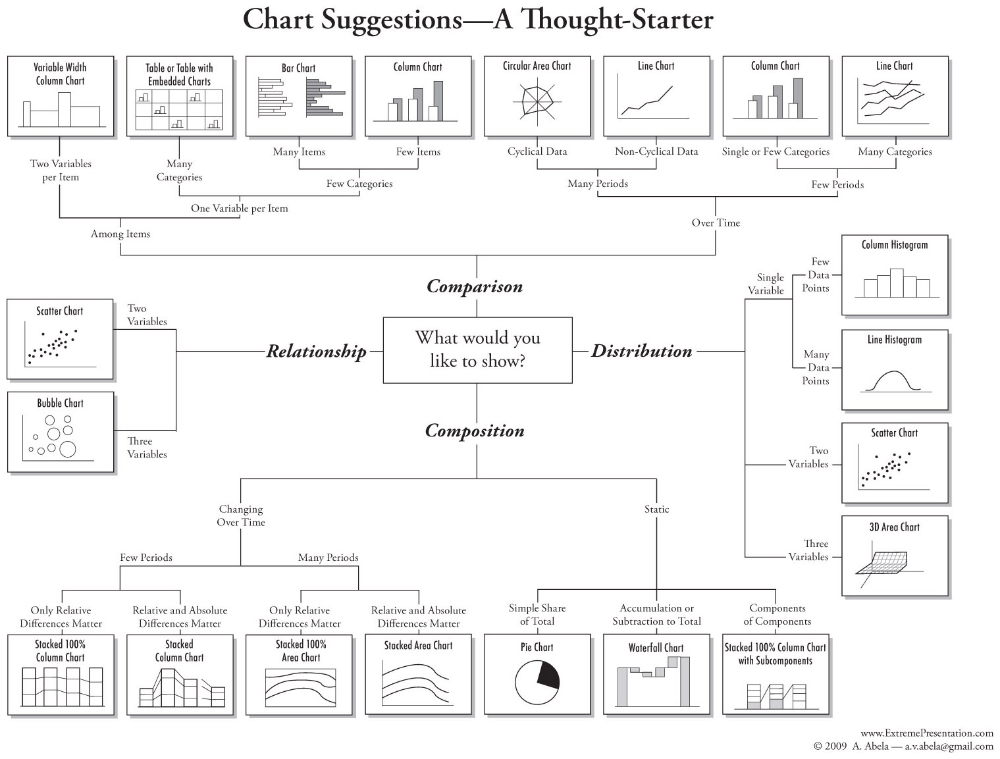

# 第九章 数据可视化

可视化作为利用数据、信息来达到目的、解决问题的最后一环，在很多时候其重要性往往高于前面的所有工作。

在经过了定义问题、收集数据、数据清洗、数据建模、评价的环节以后，终于到了要将数据分析的结果展示出来的时候，它决定了分析的结果是否可以落地，是否可以实现价值。

图形选择技巧：[Visual Business Intelligence – Abela’s Folly – A Thought Confuser (perceptualedge.com)](https://www.perceptualedge.com/blog/?p=2080)




1. comparsion：比较
2. Distribution：分布
3. Composition：构成
4. Relationship：关系

## Matplotlib

Matplotlib是python的一个绘图库，它包含了大量的工具，也提供了极大的灵活性，理论上使用者可以利用它绘制任何图形。

使用jupyter绘图，几乎必须使用的代码

```python
import matplotlib.pyplot as plt
%matplotlib inline  # 有这条代码 就不需要使用show命令了

# 设置中文格式，虽然可以源码修改，但是有些主题会把字体也设置掉，还是要设置回来。
plt.rcParams['font.sans-serif'] = 'SimHei'
plt.rcParams['axes.unicode_minus'] = False
```


#### 绘制第一个散点图

+ r\*--:带红色星型点的虚线,r代表红色,\*代表星号, --代表虚线。
+ ks.:带黑色方块点的实线
+ bD-.:带蓝色钻石点的点画线

```python
# plt.plot(x, y, format)
plt.plot([1, 2, 3, 4, 5], [1, 2, 3, 6, 10], 'ro')
plt.show()

plt.plot([1, 2, 3, 4, 5], [1, 2, 3, 6, 10], 'g*')
plt.plot([2, 5, 6, 8, 9], [5, 3, 7, 9, 11], 'bD')
plt.show()
```


完整的图

```python
# 显示中文, 可在源码改, 可忽略
plf.figure(figsize=(12, 9))
plt.xlim(0, 12)
plt.ylim(0, 12)
plt.rcParams['font.sans-serif'] = ['SimHei']
plt.rcParmas['axes.unicode_minus'] = False

plt.plot([1, 2, 3, 4, 5] ,[1, 2, 3, 6, 10], 'g*', label='绿星')
plt.plot([2, 5, 6, 8, 9], [5, 3, 7, 9, 11], 'bD', label='蓝钻')
plt.title('带有图例的散点图')
plt.xlabel('X')  # 标签
plt.ylabel('Y')
plt.legend(loc='best')
plt.show()
```


#### 理解figure与axes

matplotlib有两个基本术语：figure与axes。

figure可以当做是一个画布，在matplotlib上每个图都是在figure上绘制的，这个对象包含了所有的子图以及图形元素。

axes：想象画一幅图，这幅图包含两个散点图水平排列。此时需要使用plt.subplot(1, 2)使用子图（也称为axes）来完成这个操作。

```python
fig, (ax1, ax2) = plt.subplots(1, 2, figsize=(6, 4), sharey=True, dpi=120)  # sharey指共享子图的y轴
ax1.plot([1, 2, 3, 4, 5], [1, 2, 3, 6, 10], 'g* ')
ax2.plot([2, 5, 6, 8, 9], [5, 3, 7, 9, 11], 'bD')
ax1.set_title('绿星散点图');ax2.set_title('蓝钻散点图');
ax1.set_xlabel('X');ax2.set_xlabel('X')
ax1.set_ylabel('Y');ax2.set_ylabel('Y')
ax1.set_xlim(0, 12);ax2.set_xlim(0, 12)
ax1.set_ylim(0, 12);ax2.set_ylim(0, 12)
plt.tight_layout()  # 自动调整子图大小,使之填充整个画布
plt.show()


# 可以使用set一次性完成设置
ax1.set(title='绿星', xlabel='X', ylabel='Y', xlim=(0, 12), ylim=(0, 12))
ax2.set(title='蓝钻', xlabel='X', ylabel='Y', xlim=(0, 12), ylim=(0, 12))
```


#### matplotlib与matlab的区别

matplotlib有两种不同的绘图方式。

1. 一种是类似于matlab语法。
2. 一种是面向对象语法

matplotlib提供了plt.gca()与plt.clf()函数

+ gcf()获取当前axes和figure
+ clf()清楚当前axes和figure

```python
# matlab语法

plt.figure(figsize=(6, 4), dpi=120)
plt.subplot(1, 2, 1)  # 这里不是subplots
plt.plot([1, 2, 3, 4, 5], [1, 2, 3, 6, 10], 'g* ')
plt.title('绿星散点图')
plt.xlabel('X')
plt.ylabel('Y')
plt.xlim(0, 12)
plt.ylim(0, 12)

plt.subplot(1, 2, 2)
plt.plot([2, 5, 6, 8, 9], [5, 3, 7, 9, 11], 'bD')
plt.title('蓝钻散点图')
plt.xlabel('X')
plt.ylabel('Y')
plt.xlim(0, 12)
plt.ylim(0, 12)

plt.show()
```


#### 绘制2$\times$ 2子图

```python
# 使用面向对象实现
fig, axes = plt.subplots(2, 2, figsize=(10, 6), sharex=True, sharey=True, dpi=120)
colors = {0: 'g', 1: 'b', 2: 'r', 3: 'y'}
markers = {0: 'o', 1: 'x', 2: '*', 3: 'p'}
for i, ax in enumerate(axes.ravel()):
    ax.plot(sorted(np.random.randint(0, 10, 10)), sorted(np.random.randint(0, 10, 10)),
                   marker=markers[i], color=colors[i])
    ax.set_title('Ax:'+str(i))
    ax.yaxis.set_ticks_position('none')  # y轴不绘制刻度标记
    
plt.suptitle('有四幅子图的图形', verticalalignment='bottom', fontsize=16)
plt.tight_layout()
plt.show()

# matlab语法实现
plt.figure(figsize=(10, 6), dpi=120)
colors = {0: 'g', 1: 'b', 2: 'r', 3: 'y'}
markers = {0: 'o', 1: 'x', 2: '*', 3: 'p'}
for i in range(1, 5):
    plt.subplot(2, 2, i)
    plt.plot(sorted(np.random.randint(0, 10, 10)), sorted(np.random.randint(0, 10, 10)),
               marker=markers[i-1], color=colors[i-1])
    plt.title('Ax:'+str(i))
    # plt.yticks('none')
plt.suptitle('有四幅子图的图形', verticalalignment='bottom', fontsize=16)
plt.tight_layout()
plt.show()
```


#### 修改坐标轴属性

+ 修改坐标轴的刻度位置以及标签(plt.xticks()/ax.setxticks()/ax.setxticklabels())
+ 控制坐标轴的刻度显示位置(上/下/左/右), 使用plt.tick_params()
+ 格式刻度标签

```python
from matplotlib.ticker import FuncFormatter


def rad_to_degrees(x, pos):
    """
    实现弧度与度数的转换
    被FuncFormatter使用
    需要x, pos两个参数,返回一个字符串
    """
    return round(x * 57.2985, 2)


plt.figure(figsize=(12, 7), dpi=100)
X = np.linspace(0, 2*np.pi, 1000)
plt.plot(X, np.sin(X))
plt.plot(X, np.cos(X))
plt.xticks(ticks=np.arange(0, 440/57.2985, 90/57.2985), fontsize=12, rotation=30)  # rotation表示字体旋转
plt.tick_params(axis='both', bottom=True, top=True, left=True, right=True, direction='in', grid_color='blue')
# direction表示刻度在里还是外
plt.grid(linestyle='--', linewidth=0.5, alpha=0.5)
plt.title('Sin/Cos函数', fontsize=14)
formatter = FuncFormatter(rad_to_degrees)
plt.gca().xaxis.set_major_formatter(formatter)
plt.show()

# 不使用FuncFormatter也行,只是x为弧度制,可以通过其他方法将刻度对应过来

def my_rad_to_degrees(x):
    return x * 57.2985

plt.figure(figsize=(12, 7), dpi=100)
X = np.linspace(0, 2*np.pi, 1000)
x = my_rad_to_degrees(X)
plt.plot(x, np.sin(X))
plt.plot(x, np.cos(X))
plt.xticks(ticks=np.arange(0, 440, 90), fontsize=12, rotation=30)  # rotation表示字体旋转
plt.tick_params(axis='both', bottom=True, top=True, left=True, right=True, direction='in', grid_color='blue')
# direction表示刻度在里还是外
plt.grid(linestyle='--', linewidth=0.5, alpha=0.5)
plt.title('Sin/Cos函数', fontsize=14)
plt.show()
```


#### 修改图形属性

matplotlib中的各图形组建的外观都可以通过其属性进行修改,对应到代码就是通过rcParams进行全局设置。

```python
import matplotlib as mpl

mpl.rc_params()  # 返回一个字典，进行是图形属性设置

# 通过调用mpl.rc_params.update(字典)继续修改
mpl.rcParams.update({'font.size':18, 'font.family': 'STIXGeneral', 'mathtext.fontset': 'stix'})
mpl.rcParams.get('font.size')  # 得用get,如果直接索引,不修改的,很奇怪
# 恢复原来的设置
mpl.reParams.update(mpl.rcParamsDefault)
```

我们一般不进行人工设置图形属性，一是比较麻烦，另外就是可能使得整个图形的样式存在这样或那样的不一致。

因此matplotlib提供了一些样式给用户选择。

```python
plt.style.available  # 返回的是一个列表,里面是系统已经安装的样式

# 选择哪种样式进行绘图,只需要指定一些就可以
plt.style.use('bmh')
plt.figure(figsize=(7, 4), dpi=80)

X = np.linspace(0, 2*np.pi, 1000)
plt.plot(X, np.sin(X))
plt.plot(X, np.cos(X))
plt.xticks(ticks=np.arange(0, 440/57.2985, 90/57.2985),
          labels=[r'$0$', r'$\frac{\pi}{2}$', r'$\pi$', r'$\frac{3\pi}{2}$', r'$2\pi$'])
# labels是用值代替ticks值,使用latex语法
plt.ylim(-1.25, 1.25)
plt.xlim(-.5, 7)
# plt.gca().set(ylim=(-1.25, 1.25), xlim=(-.5, 7))  # plt是没有set方法的,所以要快捷设置就得获取axes,因此前面要使用该函数
plt.show()
```


matplotlib提供了三组不同的颜色，CSS4风格，XKCD风格和系统的基础色

```python
mpl.colors.CSS4-COLORS # 148 colors
mpl.colors.XKCD_COLORS # 949 colors
mpl.colors.BASE_COLORS # 8   colors

# 调用'b'为调用系统自带的蓝色, 调用'blue'为调用CSS的蓝色

# 提供了调色板
dir(mpl.cm)  # 查看调色板
```


#### 定制图例,添加标注

绘图过程中，经常会遇到图例说明、在特定位置添加标注以及文本说明的情况。

```python
# 不使用对象，单纯使用legend
mpl.rcParams.update(mpl.rcParamsDefault)
plt.style.use('seaborn-notebook')
plt.figure(figsize=(10, 7), dpi=80)
X = np.linspace(0, 2*np.pi, 1000)
plt.plot(X, np.sin(X), label='$\sin (x)$')
plt.plot(X, np.cos(X), label='$\cos (x)$')
plt.legend(loc='best')
plt.show()


"""
plt.legend(handles, labels, loc)
handles传入要处理的图形
labels传入添加的图例
loc设置为位置
"""

mpl.rcParams.update(mpl.rcParamsDefault)
plt.style.use('ggplot')
plt.figure(figsize=(10, 7), dpi=80)
X = np.linspace(0, 2*np.pi, 1000)
sine_1, = plt.plot(X, np.sin(X), label='1')  # 这里返回了Line2D对象, 使用legend的时候只要第一个
cosine_1 = plt.plot(X, np.cos(X), label='2')
plt.legend(handles=[sine_1, cosine_1[0]], labels=['sin函数', 'cos函数'],
           # 以下指的是图例
           frameon=True, # 指明是否画边框
           framealpha=1, # 边框透明度
           ncol=2, # 指明画两列
           shadow=True, # 指明是否有阴影
           borderpad=1,  # 指明边框厚度
           title='sin和cos', # 指明图例的标题
           loc='best'
          )  # 这里的labels优先级最高,如果plot使用了label,则以labels为准
plt.title('sin和cos')
plt.show()
```


plt.annotate()函数添加文本说明，plt.text()给图形添加标注

```python
mpl.rcParams.update(mpl.rcParamsDefault)
plt.style.use('seaborn-notebook')
plt.figure(figsize=(14, 7), dpi=120)
X = np.linspace(0, 8*np.pi, 1000)
plt.plot(X, np.sin(X), color='tab:blue')

# 使用ArrowProps 和bbox设置标注
plt.annotate('峰', xy=(90/57.2985, 1.0), xytext=(90/57.2985, 1.5),  # xy指了文字箭头位置, xytext为文字位置
            bbox=dict(boxstyle='circle', fc='green', linewidth=0.1),   # 文本框样式
            arrowprops=dict(facecolor='green', shrink=0.01, width=0.1),  # 箭头样式
            fontsize=12, color='white', horizontalalignment='center')


# 文本
for angle in [440, 810, 1170]:
    # plt.text(x, y, str, format) 在传入x,y的时候有相对位置,可以用transform参数设置,这里略
    plt.text(angle/57.2985, 1.05, str(angle)+'\n度',
             horizontalalignment='center', color='green')
for angle in [270, 630, 990, 1350]:
    plt.text(angle/57.2985, -1.3, str(angle)+'\n度',
             horizontalalignment='center', color='green')
plt.xlim(-.5, 26)
plt.ylim(-2.0, 2.0)
plt.show()
```


#### 子图

之前我们已经实现了子图的绘制,但很多时候绘图需要对子图有更精确的大小控制,此时需要用到plt.subplot2grid()或plt.GridSpec()函数

```python
fig = plt.figure()
# 第一个参数为将画布分为(3, 3), 第二个参数是指当前轴在(0, 0)位置, colspan表示列宽度, rawspan表示行宽度默认均为1
ax1 = plt.subplot2grid((3, 3), (0, 0), colspan=2, rowspan=2)
ax3 = plt.subplot2grid((3, 3), (0, 2), rowspan=3)
ax4 = plt.subplot2grid((3, 3), (2, 0))
ax5 = plt.subplot2grid((3, 3), (2, 1))
fig.tight_layout()
plt.show()


# 利用plt.GridSpec()方法也可以完成
fig = plt.figure()
grid = plt.GridSpec(2, 3)  # 定义一个2*3
ax1 = plt.subplot(grid[0, :2])
ax2 = plt.subplot(grid[0, 2])
ax3 = plt.subplot(grid[1, :1])
ax3 = plt.subplot(grid[1, 1:])
plt.show()
```


除了子图，数据分析中有时还会绘制图中图，即在原图形区域中创建一个新的图形区域来放大显示某部分图形。

```python
plt.rcParams.update(plt.rcParamsDefault)
plt.style.use('seaborn-whitegrid')
plt.rcParams['font.sans-serif'] = 'SimHei'
plt.rcParams['axes.unicode_minus'] = False
fig, ax = plt.subplots(figsize=(10, 6))
x = np.linspace(-.5, 1., 1000)
# 外部图形
ax.plot(x, x**2)
ax.plot(x, np.sin(x))
ax.set(xlim=(-.5, 1.0), ylim=(-0.5, 1.2))
fig.tight_layout()
# 内部图形
inner_ax = fig.add_axes([0.2, 0.55, 0.35, 0.35])
# 给出图片的比例.left,bottom, width,height
# 即左边20%位置开始, 下面从55%开始, 宽高维figure的35%
inner_ax.plot(x, x**2)
inner_ax.plot(x, np.sin(x))
inner_ax.set(title='放大', xlim=(-.2, .2), ylim=(-.01, .02),
             yticks=[-0.01, 0, 0.01, 0.02], xticks=[-0.1, 0, .1])
ax.set_title('图形内绘图')
plt.show()
```


#### 利用matplotlib绘制各种图形

气泡图

```python
# 气泡图案例
import pandas as pd
file = r'../data/midwest_filter.csv'
midwest = pd.read_csv(file)
midwest.columns
"""
['PID', 'county', 'state', 'area', 'poptotal', 'popdensity', 'popwhite',
       'popblack', 'popamerindian', 'popasian', 'popother', 'percwhite',
       'percblack', 'percamerindan', 'percasian', 'percother', 'popadults',
       'perchsd', 'percollege', 'percprof', 'poppovertyknown',
       'percpovertyknown', 'percbelowpoverty', 'percchildbelowpovert',
       'percadultpoverty', 'percelderlypoverty', 'inmetro', 'category',
       'dot_size']
"""
fig = plt.figure(figsize=(14, 7), dpi=80, facecolor='w', edgecolor='k')  # 背景色为白色，边框为黑色
# 'area', 'poptotal'分别为midwest中的了两列, 其中area为x列, poptotal为y列, s的大小由dot_size决定
plt.scatter('area', 'poptotal', data=midwest, s='dot_size', c='popdensity',
           cmap='Reds', edgecolors='black', linewidths=.5)
plt.title('气泡图')
plt.xlabel('面积', fontsize=18)
plt.ylabel('人口总数', fontsize=18)
plt.colorbar()  # 会在图形右边绘制色条
plt.show()
```


散点图、步进图、箱线图、直方图等整合在一个图中。

```python
# 绘图所使用数据
n = np.array([0, 1, 2, 3, 4, 5])
x = np.linspace(0, 5, 10)
xx = np.linspace(-0.75, 1, 100)
# 定义子图
fig = plt.figure(figsize=(10, 5))
ax1 = plt.subplot2grid((2, 4), (0, 0))
ax2 = plt.subplot2grid((2, 4), (0, 1))
ax3 = plt.subplot2grid((2, 4), (0, 2))
ax4 = plt.subplot2grid((2, 4), (0, 3))
ax5 = plt.subplot2grid((2, 4), (1, 0), colspan=2)
ax6 = plt.subplot2grid((2, 4), (1, 2))
ax7 = plt.subplot2grid((2, 4), (1, 3))
# 开始绘图
ax1.scatter(xx, xx+np.random.randn(len(xx)))
ax1.set_title('散点图')

ax2.step(n, n**2, lw=2)  # 阶梯图,也就是把线性图变成阶梯形
ax2.set_title('阶梯图')

ax3.bar(n, n**2, align='center', width=0.5, alpha=0.5)
ax3.set_title('条形图')

ax4.fill_between(x, x**2, x**3, color='steelblue', alpha=0.5)
ax4.set_title('区域填充图')

dates = pd.date_range('2018-01-01', periods=len(xx))
ax5.plot(dates, xx+np.random.randn(len(xx)))
ax5.set_xticks(dates[::30])
ax5.set_xticklabels(dates.strftime('%Y-%m-%d')[::30])
ax5.set_title('时间序列图')

ax6.boxplot([np.random.randn(len(xx)), xx])
ax6.set_xticklabels(['随机数', 'xx'])
ax6.set_title('箱线图')

ax7.hist(xx+np.random.randn(len(xx)))
ax7.set_title('直方图')
# 展示
fig.tight_layout()
plt.show()
```


双y轴显示

```python
import matplotlib.pyplot as plt
import pandas as pd
import numpy as np
import matplotlib as mpl
%matplotlib inline

file = r'../data/economics.csv'
df = pd.read_csv(file)
df.head()

x, y1, y2 = df['date'], df['psavert'], df['unemploy']

fig, ax1 = plt.subplots(1, 1, figsize=(16, 7), dpi=80)
ax1.plot(x, y1, color='tab:red')
ax2 = ax1.twinx()  # 与ax1共享x轴
ax2.plot(x, y2, color='tab:blue')

ax1.set_xlabel('日期', fontsize=16)
ax1.set_ylabel('储蓄率', color='tab:red', fontsize=16)
ax1.tick_params(axis='y', rotation=0)# , labelcolor='tab:red')


plt.title('储蓄率 VS 失业率', fontsize=16)
# ax2.set_title('储蓄率 VS 失业率', fontsize=16)
ax2.set_ylabel('失业率(1000)', color='tab:blue', fontsize=16)
ax2.set_xticks(np.arange(0, len(x), 60))
ax2.set_xticklabels(x[::60], rotation=90, fontdict={'fontsize': 10})
plt.show()
```


## pandas绘图

由于大量的数据分析都是基于pandas完成的，而在分析过程中数据分析人员经常会对数据进行可视化，此时的目标不是图形美观，而是迅速发现数据中的模式和规律。因此为了实现这一目标，pandas中为DataFrame集成了plot()函数，该函数为plt.plot()函数进行了封装以完成快速绘图。


#### pandas基础绘图

DataFrame中的plot()函数是为了快速探索数据而产生的，因此绘图方法中只提供了除默认线图以外的极少数绘图方法。这些方法作为plot()函数的kind参数提供，具体包括：

+ bar或barh:条形图或水平条形图
+ hist:直方图
+ boxplot:箱线图
+ area:区域填充图
+ scatter:散点图


```python
df = pd.DataFrame(np.random.rand(10, 4), columns=['a', 'b', 'c', 'd'])
df.plot(kind='bar')
df.plot.bar()

df.plot.bar(stacked=True)  # 使用堆叠法,就是一根柱子好多颜色。

# 饼图
df = pd.DataFrame(100*np.random.rand(5), index=['a', 'b', 'c', 'd', 'e'], columns=['sales'])
df.plot(kind='pie', subplots=True)  # subplots必须为True， 行为类别，
```


#### 整合pandas绘图和matplotlib绘图

可以将pandas的快速绘图与matplotlib的精细化图形设置结合起来。

```python
mpl.rcParams.update(mpl.rcParamsDefault)
mpl.style.use('fivethirtyeight')
fig, ax = plt.subplots(figsize=(5, 6))
top10.plot(kind='barh', y='Sales', x='Name', ax=ax)  # 得把图画在ax上,不然设置不了
ax.set_xlim([0, 140000])
ax.set(title='2014年销售额', xlabel='销售额', ylabel='客户')
# ax.legend()
ax.legend().set_visible(False)  # 由于pandas绘图,自带图例,这个展示其实不需要使用图例,把图例取消掉
plt.show()

# 小优化
avg = top10['Sales'].mean()
mpl.rcParams.update(mpl.rcParamsDefault)
mpl.style.use('fivethirtyeight')
fig, ax = plt.subplots(figsize=(5, 6))
top10.plot(kind='barh', y='Sales', x='Name', ax=ax)
ax.set_xlim([-10000, 140000])
ax.set(title='2014年销售额', xlabel='销售额', ylabel='客户')
ax.axvline(x=avg, color='b', label='Average', linestyle='--', linewidth=1)
# 添加一条横线,有参数ymax与ymin设置, axhline为设置一条水平线
for cust in [3, 5, 8]:
    ax.text(115000, cust, "新发展客户")  # 在对应位置写下文字
# ax.legend()
ax.legend().set_visible(False)
plt.show()
```


## Seaborn

由于matplotlib比较底层，想要绘制漂亮的图非常麻烦，需要写大量的代码。为了解决这一问题，开发了Seaborn。

如果matplotlib是力图让简单的事情简单，困难的事情成为可能，那么Seaborn就是让一系列定义好的困难的事情也变得简单。Seaborn是在matplotlib基础上进行了高级的API封装，图表装饰更加容易，使用者可以用更少的代码作出更美观的图。

Seaborn提供了：

+ 计算多变量间关系的面向数据集接口;
+ 可视化类别变量的观测与统计;
+ 可视化单变量或多变量分布并与其子数据集比较;
+ 控制线性回归的不同因变量进行参数估计并作图;
+ 对复杂数据进行易行的整体结构可视化;
+ 对多表统计图的制作高度抽象并简化可视化过程;
+ 提供多个内建主体渲染matplotlib的图形样式;
+ 提供调色板工具生动再现数据;
+ 同时支持矩阵数据和DataFrame;


### Seaborn的样式

Seaborn装载了一些默认主题风格，主题风格的选择通过sns.set()方法实现。

```python
sns.set()  # 提供了五种风格的图表背景:darkgrid(默认), whitegrid, dark, white,, ticks


tips = sns.load_dataset('tips')
sns.set(style='white', palette='Paired')  # 可以在这里直接设置字体等图表样式,这里修改了调色板和主题
sns.relplot(x='total_bill', y='tip', data=tips, col='sex', hue='smoker', size='size')
# relplot为散点图, col参数表面需要按不同性别进行可视化,即画两个图,一个是男的,一个是女的。
# hue参数代表是否根据吸烟来进行不同颜色区分,size根据吃饭人数来决定散点大小.

sns.distplot(df['Attack'])  # 叠加概率密度曲线的直方图
sns.lmplot(x='Attack', y='Defense', data=df)  # 提供散点图和回归线

# fit_reg取消回归线, hue 不同的类型绘制不同的颜色
sns.lmplot(x='Attack', y='Defense', data=df, fit_reg=False, hue='Type1')  # 若这里采用回归线,则会不同类别用一条回归线

sns.jointplot(x='Attack', y='Defense', data=df)  # 联合分布图,中间为散点图,两边有各自的概率密度图

sns.boxplot(data=df)  # 箱线图 如果全传入的话,会自动对数值列进行箱线图绘制,非数值列会自动忽略
plt.xticks(rotation=30)  # 由于x轴重叠,故让x轴标签进行旋转30°

plt.figure(figsize=(12, 8))
sns.set_style('whitegrid')
sns.violinplot(x='Type1', y='Attack', data=df)  # 小提琴图,在箱线图的基础上,还提供了数据分布信息.
plt.xticks(rotation=10);

plt.figure(figsize=(12, 8))
sns.swarmplot(x='Type1', y='Attack', data=df)  # 就是用直接数据来代替向箱线图

# 两个图要结合
plt.figure(figsize=(12, 8))
sns.swarmplot(x='Type1', y='Attack', data=df, color='k')  # 就是用直接数据来代替向箱线图
sns.violinplot(x='Type1', y='Attack', data=df, inner=None)  # inner就是将中间的图案去掉
plt.title('Attack by Type')

# 热力图
stats_df = df[['Hp', 'Attack', 'Special Attack', 'Special Defense', 'Speed']]
corr = stats_df.corr()
sns.heatmap(corr)

```


在Seaborn中探索数据时, 常用到的一种方法就是在数据集的不同子集上绘制同一图的多个实例。这种技术有时被称为“facet”或“grid”绘图。这种方式在某种意义上将可视化的维度提高到了三维或四维。

```python
g = sns.FacetGrid(df, col='Type1', margin_titles=False)
g.map(sns.regplot, 'Attack', 'Defense', color='k', fit_reg=True, x_jitter=.2)

# 首先通过facetgrid函数指定想要可视化的数据，以何种方式进行布局，通过col或者row指定 这里也就是用列来指定每一个type1
# 这个函数会返回一个FacetGird对象，即g，该对象包含了定义的布局。
# 完成布局的定义，就是将数据映射到这个布局中，也就是要画什么图
# g.map告诉Seaborn,我们使用'Attack'和'Defense'这两列,用regplot来展示他们的关系
```

